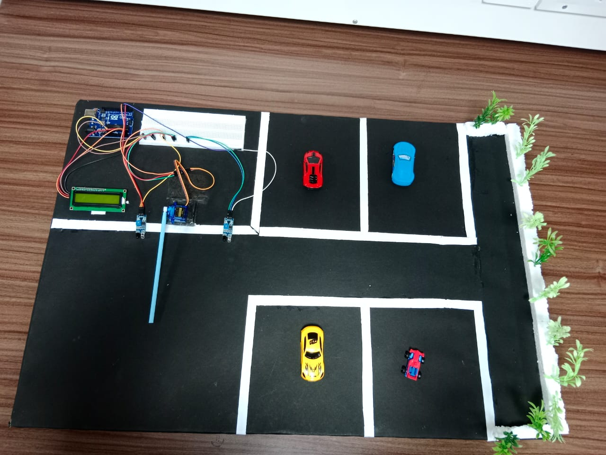

# Smart Parking System 🚗🔒

A simple IoT-based Smart Parking System using:
- Arduino UNO
- IR Sensors
- Servo Motor
- 16x2 I2C LCD

---

## 📷 Project Images

### 🔌 Hardware Setup:

### 🚘 Working Demo:

---

---

## 🧠 Features

- Detects car entry/exit using IR sensors
- Opens/closes gate using servo
- Updates available slots on LCD
- Blocks entry when parking is full

---

## 🛠 Components Used

| Component      | Description        |
|----------------|--------------------|
| Arduino UNO    | Main controller    |
| IR Sensors     | Entry & Exit       |
| Servo Motor    | Gate controller    |
| LCD (I2C)      | Display slots info |
| Breadboard     | Connections        |

---

## 💾 Code

See SmartParkingSystem.ino for full code.

---

## 🔮 Future Scope

- Add Raspberry Pi for cloud sync
- Add RFID for vehicle authentication
- Web/mobile dashboard integration

---

## 📜 License

MIT License (Free to use and modify)